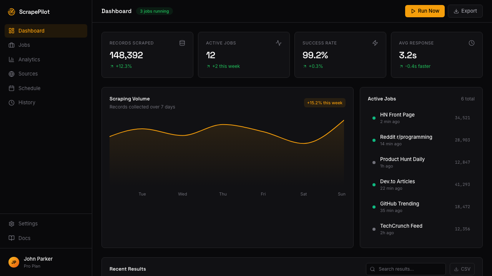
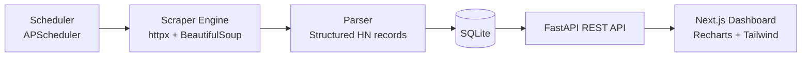

# 📊 ScrapePilot
A premium web scraping + analytics dashboard that scrapes live Hacker News data and turns it into actionable trend intelligence.



## Features
- Configurable scraper engine for public Hacker News pages (respectful rate limiting + robust error handling)
- Dark, polished analytics dashboard (Grafana x Linear style) with oklch color system and animated Recharts visualizations
- Stat cards with trend indicators (↑ ↓), top sources bar chart, and topic trends over time
- Search/filter/sort table for scraped records
- Live scrape status indicator + manual trigger
- Scrape run history with success rate and volume metrics
- CSV and JSON export endpoints
- Scheduled scraping with adjustable interval and next run visibility
- Fully typed FastAPI + TypeScript strict mode frontend

## Tech Stack


## Quick Start (Docker Compose)
```bash
git clone https://github.com/MickyKee/scrapepilot.git
cd scrapepilot
docker compose up --build
```

Open:
- Frontend: `http://localhost:3000`
- API docs: `http://localhost:8000/docs`

## Local Development
```bash
# 1) API
python3 -m venv .venv
source .venv/bin/activate
pip install -r api/requirements.txt
PYTHONPATH=. uvicorn api.app.main:app --reload --host 0.0.0.0 --port 8000

# 2) Frontend (new terminal)
cd frontend
pnpm install
NEXT_PUBLIC_API_BASE_URL=http://localhost:8000 pnpm dev
```

## API Documentation (Brief)
- `GET /health` - health check
- `POST /scrape/run` - trigger immediate scrape run
- `GET /scrape/status` - live scraper status + next run
- `GET /analytics/summary` - stat cards payload
- `GET /analytics/trending` - topic trend series
- `GET /analytics/domains` - top domains count
- `GET /items` - paginated items with `search/source/sort_by/sort_order`
- `GET /history` - scrape run history and success rate
- `GET /schedule` / `POST /schedule` - read/update scheduler interval
- `GET /export/csv` and `GET /export/json` - data exports

## Architecture


## Project Structure
```text
scrapepilot/
  api/         # FastAPI app, models, services, scheduler wiring
  scraper/     # Hacker News scraper implementation
  frontend/    # Next.js dashboard UI
  docs/        # Dashboard screenshots
```

## Environment Variables
Copy `.env.example` and override as needed:
- `DATABASE_URL`
- `SCRAPER_PAGES`
- `SCRAPER_REQUEST_DELAY_MS`
- `SCRAPE_INTERVAL_MINUTES`
- `ALLOWED_ORIGINS`
- `NEXT_PUBLIC_API_BASE_URL`

## License
MIT
